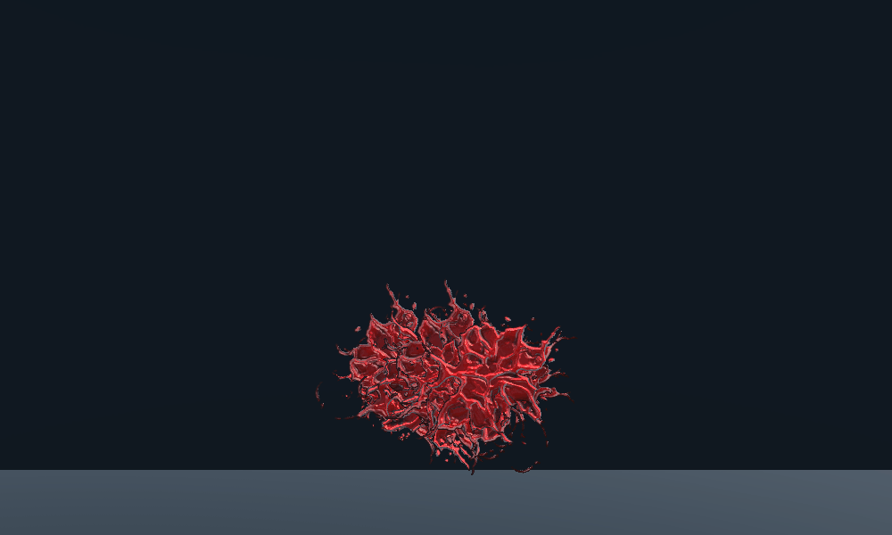

# Effects
Selfmade effects with VFX Graph, Shader Graph, Trail Renderer, Particle System

## How it looks
### Ezreal like Slash Effect
Maded with VFX Graph, Shader Graph, Trail Renderer, Blender, Krita  

  

### Projectile
Maded with VFX Graph, Shader Graph, Trail Renderer  

  

### Fire
Maded with VFX Graph, Shader Graph, Photoshop

  

### Flame Thrower
Maded with VFX Graph, Shader Graph, Photoshop
  

### Tornado
Maded with Particle System, Shader Graph, Blender

  

### Blood Splash
Maded with Particle System, Shader Graph, Photoshop

  

### Stylized Explosion
Maded with Particle System, Shader Graph, Photoshop

  
