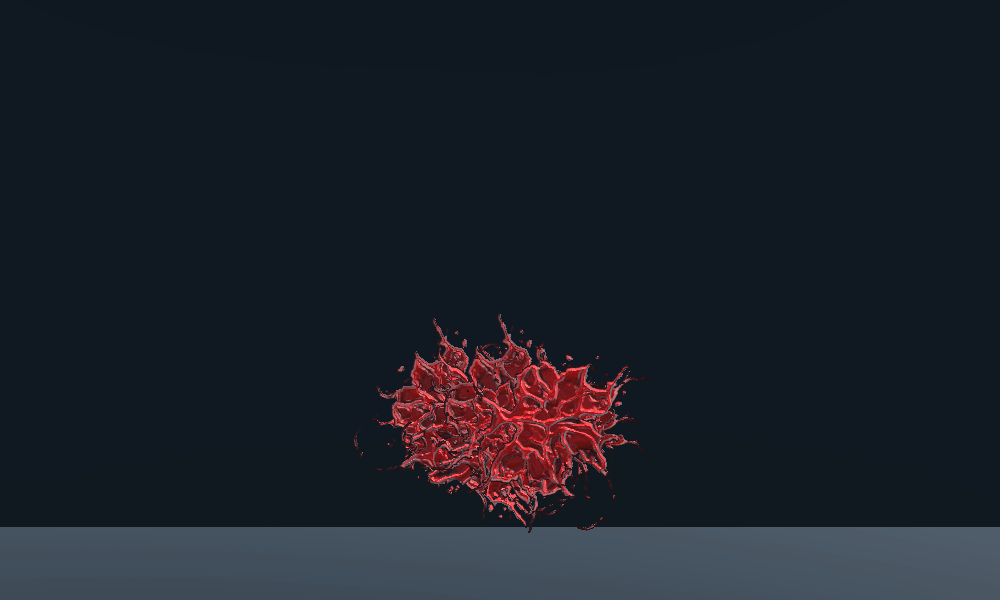
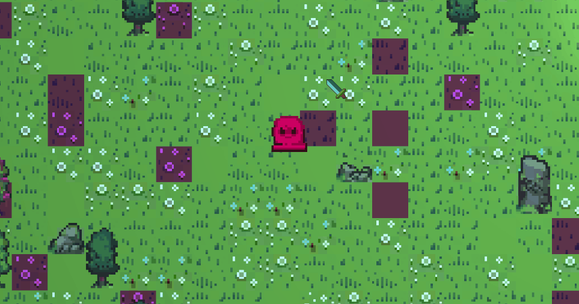
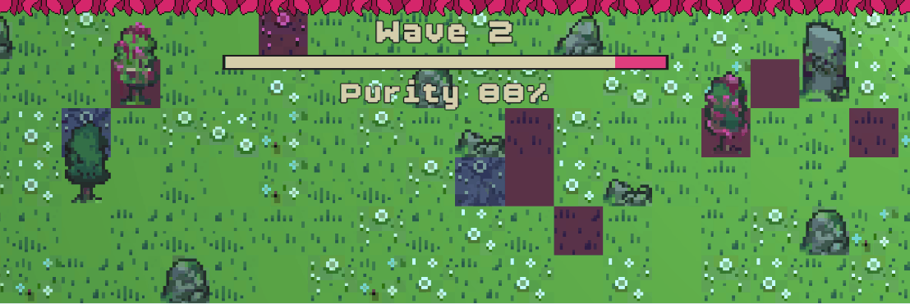
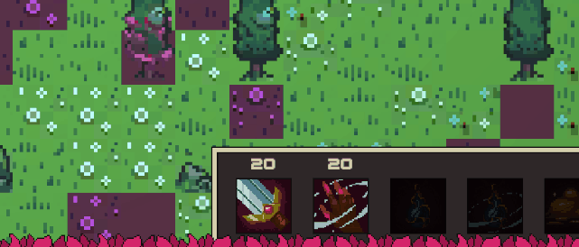
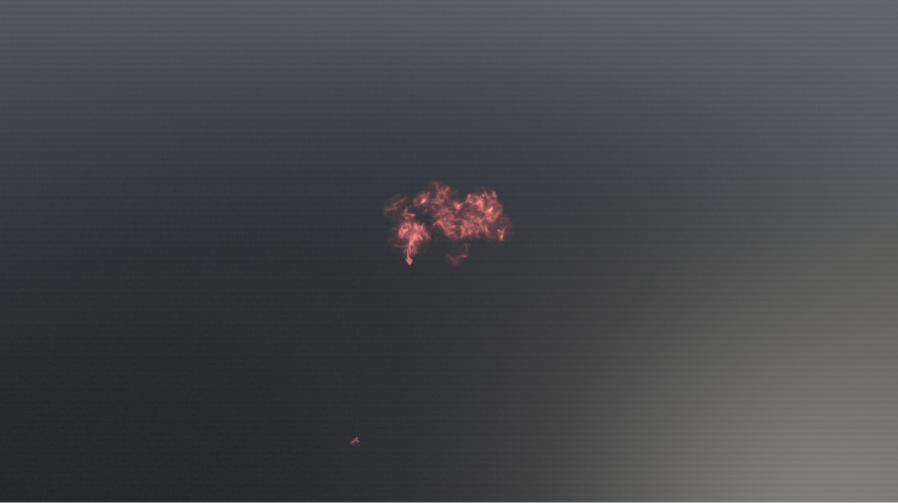
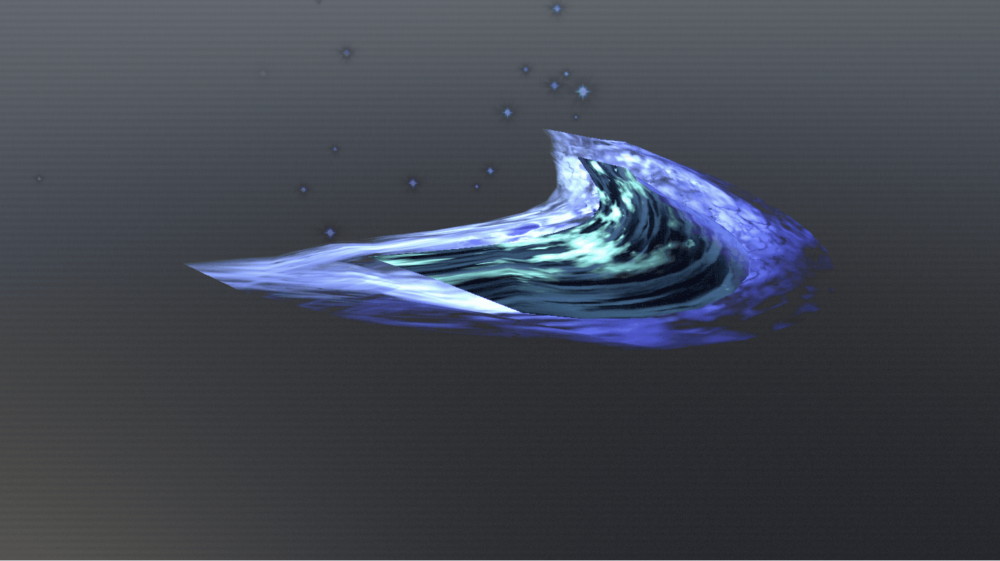

# Effects
Self-made effects with VFX Graph, Shader Graph, Trail Renderer, Particle System

## How it looks
### Ezreal like Slash Effect
Made with VFX Graph, Shader Graph, Trail Renderer, Blender, Krita  

  

### Projectile
Made with VFX Graph, Shader Graph, Trail Renderer  

  

### Fire
Made with VFX Graph, Shader Graph, Photoshop

  

### Flame Thrower
Made with VFX Graph, Shader Graph, Photoshop
  

### Tornado
Made with Particle System, Shader Graph, Blender

  

### Blood Splash
Made with Particle System, Shader Graph, Photoshop

  

### Stylized Explosion
Made with Particle System, Shader Graph, Photoshop

  

# Effects from projects

## [Grimlands](https://freeman12412421.itch.io/grimlands)
In this project I worked on 2D Effects, 2D Effects in UI and made Tween animations.
### Effect on click
Made with Particle System, Shader Graph, Photoshop

  

### Effect after wave clear
Made with Particle System, Shader Graph, Photoshop. This effect integrated in UI with [this asset](https://github.com/mob-sakai/ParticleEffectForUGUI)

 

### Effects after Upgrade
Made with Particle System, Shader Graph, Photoshop. This effect integrated in UI with [this asset](https://github.com/mob-sakai/ParticleEffectForUGUI)

 

## [Vindicta] (https://freeman12412421.itch.io/vindicta)
In this project I created some 3D effects for spells.
### Blood Effect
Made with Particle System, Shader Graph, Photoshop.

 

### Boss Arrow Attack
Made with Particle System, Shader Graph, Photoshop, Blender.

 

### Boss Slash Attack
Made with Particle System, Shader Graph, Photoshop. Player has similar attack but with red tones.

### Fall Effect
Made with Particle System, Shader Graph, Photoshop, Blender. That effect was cut off from the game (because we abandoned vertical gameplay idea), but I found an interesting shape for that effect.

 

